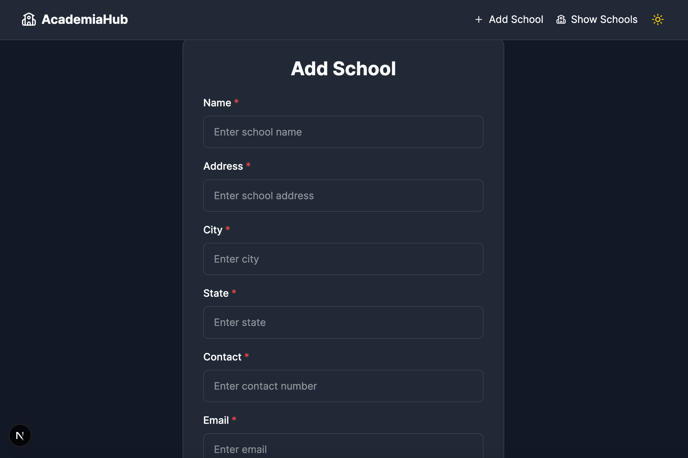
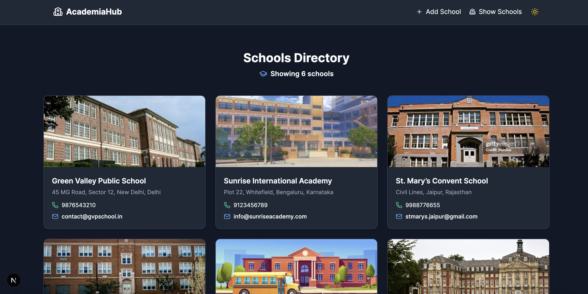

# School Management System

A mini-project built with **Next.js** and **MySQL** for managing schools.  
It allows users to **add new schools** and **view the list of schools** in an ecommerce-style layout.  
Deployed on Vercel.

---

## 🚀 Live Demo
🔗 [Live Project](https://school-management-gray-zeta.vercel.app)  

## 📂 GitHub Repository
🔗 [GitHub Repo](https://github.com/sharmaHarshit2000/school-management)

---

## 📸 Screenshots

### Homepage


### Add School Page


### Show Schools Page


---

## 🛠 Tech Stack
- **Next.js 14** (App Router)
- **MySQL** (via Railway)
- **Prisma ORM**
- **Cloudinary** (for image upload)
- **Tailwind CSS** (for styling)
- **React Hook Form** (form handling & validation)

---

## ⚙️ Setup Instructions

### 1. Clone the Repository
```bash
git clone https://github.com/sharmaHarshit2000/school-management.git
cd school-management
```

### 2. Install Dependencies
```bash
npm install
```

### 3. Configure Environment Variables
Create a `.env.local` file in the root of your project and add the following:

```env
# Database Configuration
DB_HOST=interchange.proxy.rlwy.net
DB_PORT=38180
DB_USER=root
DB_PASSWORD=your_password
DB_NAME=railway

CLOUDINARY_CLOUD_NAME=cloudinary_cloud_name
CLOUDINARY_API_KEY=api_key
CLOUDINARY_API_SECRET=api_secret
```


### 4. Run the Project Locally
```bash
npm run dev
```

Your project should now be running on [http://localhost:3000](http://localhost:3000).

---

## 📁 Project Structure
```
school-management/
├── public/
├── src/
│   ├── app/
│   │   ├── addSchool/         # Add School page
│   │   ├── showSchools/       # Show Schools page
│   │   ├── api/schools/       # API route for schools
│   │   ├── components/        # Reusable components
│   │   ├── lib/               # Cloudinary helper
│   │   ├── styles/            # Global styles
│   │   ├── layout.tsx         # Root layout
│   │   ├── page.tsx           # Homepage
│   │   └── error.tsx          # Error page
├── .env.local                 # Environment variables
├── package.json
├── tsconfig.json
└── README.md
```

---

## 📌 Features
- Add schools with **form validation**
- Upload school images to **Cloudinary**
- Store school data in **MySQL**
- Display schools in **grid layout**
- Fully responsive (Mobile + Desktop)
- Dark/Light mode support

---

## 📤 Submission
- GitHub Repo: [https://github.com/sharmaHarshit2000/school-management](https://github.com/sharmaHarshit2000/school-management)  
- Live Link: [https://school-management-gray-zeta.vercel.app](https://school-management-gray-zeta.vercel.app)  
- README with setup instructions (this file)

---

